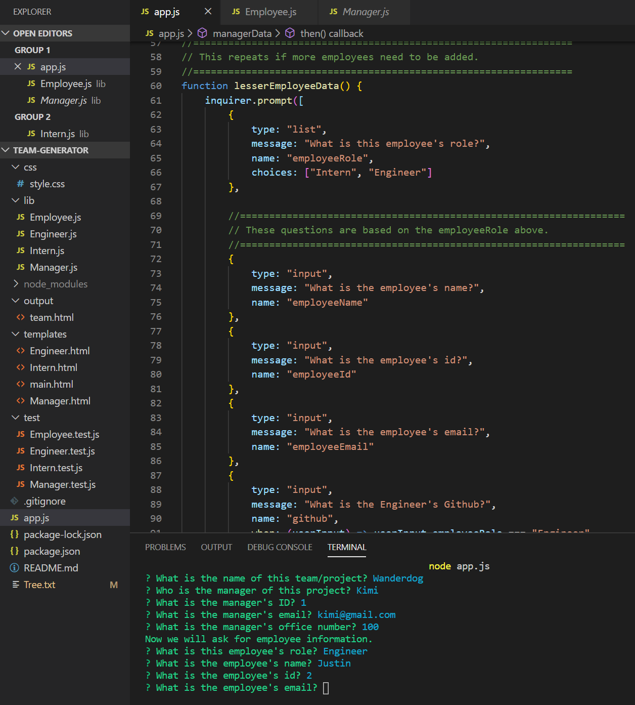

# Team Generator

A CLI app that a Node CLI that takes in information about employees and generates an HTML webpage that displays summaries for each person. Since testing is a key piece in making code maintainable, you will also be ensuring that all unit tests pass.

## Instructions

This is a software engineering team generator command line application. The application will prompt the user for information about the team manager and then information about the team members. The user can input any number of team members, and they may be a mix of engineers and interns. This assignment must also pass all unit tests. When the user has completed building the team, the application will create an HTML file that displays a nicely formatted team roster based on the information provided by the user.
 
### How To Use The App:
1. Clone the repo from https://github.com/cml2377/team-generator
2. Install the modules with: npm install
3. Open app.js in Terminal, then input: node app.js
4. Follow the instructions on the screen. 
5. The program will generate an HTML with your provided information.

## Requirements

* This app runs as a Node CLI to gather information about each employee.

The dependencies are: [jest](https://jestjs.io/) for running the provided tests, and [inquirer](https://www.npmjs.com/package/inquirer) for collecting input from the user.

### User input

The project prompts the user to build an engineering team. An engineering
team consists of a manager, and any number of engineers and interns.

### Roster output

The project generates a `team.html` page in the `output` directory, that displays a nicely formatted team roster. Each team member should display the following in no particular order:

  * Name

  * Role

  * ID

  * Role-specific property (School, link to GitHub profile, or office number)

## Thanks

* Thanks to the coding bootcamp at UT Austin for this challenge.
* Thank you any templates/fonts/css I used.
* Thanks to all of the node_modules that I used.